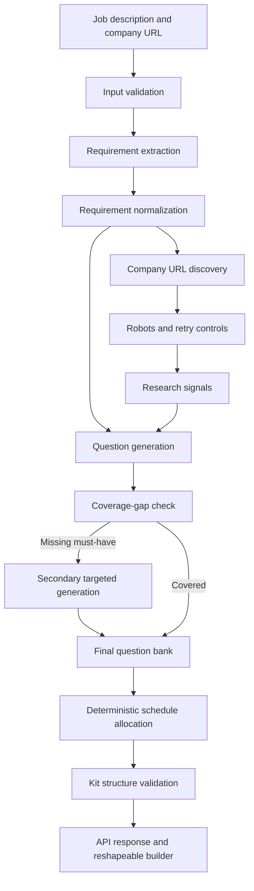

# AI Interview Prep Kit Generator  

The AI Interview Prep Kit Generator is a full-stack application that transforms a raw job description and an optional company URL into a structured, role-specific interview preparation kit.

The product is designed around a reshapeable preparation workspace rather than a one-shot document. A generated kit can contain a company brief, role requirements, categorized questions, answer outlines, flashcards, and a day-by-day study schedule. Users can edit, pin, reorder, recategorize, regenerate, and practice against the resulting material.

## 1. Project Overview & Tech Stack

### Product scope

The application supports the following workflow:

1. A user authenticates with the backend.
2. The user supplies a job description, optional company URL, role, study horizon, and session duration.
3. The backend extracts and normalizes role requirements.
4. The research layer discovers relevant company pages while respecting crawl constraints.
5. The generation layer creates mapped interview questions and validates coverage.
6. Deterministic scheduling distributes must-have topics across the requested study period.
7. The frontend presents the result as an editable kit workbench with practice mode.

### Technology stack

| Layer | Technology | Responsibility |
| --- | --- | --- |
| Frontend | React 19, Vite | Component-based application shell and client-side interaction |
| Styling | Tailwind CSS | Utility-first responsive styling and workspace layout |
| Icons | Lucide-compatible UI direction | Familiar iconography for controls; add `lucide-react` when icon primitives are introduced |
| Backend | Node.js, Express | HTTP API, middleware, authentication, rate limiting, and route composition |
| Persistence | Mongoose / MongoDB | User, kit, requirement, question, flashcard, and schedule data models |
| Retrieval | Native `fetch`, URL APIs, robots parsing | Company-page discovery, bounded crawling, retry, timeout, and graceful failure |
| Validation | Deterministic JavaScript services | Requirement normalization, coverage checks, schedule arithmetic, and kit validation |
| Testing | Node.js built-in test runner | Service-level regression tests for deterministic backend behavior |

### AI and retrieval implementation

The generation service uses Google Gemini for role-specific requirements, interview questions, answer guidance, and company brief content. Gemini output is requested as structured JSON and normalized server-side before it can enter the kit.

The application keeps deterministic controls around the model:

- Gemini identifies and classifies requirements and creates role-specific questions instead of generic templates.
- `coverageGapCheck` identifies must-have requirements without a question and triggers a targeted Gemini repair pass.
- `validateGeneratedKit` verifies the generated structure before it is returned.
- `allocateStudySchedule` performs pure programmatic allocation, prioritizing harder must-have requirements.

The retrieval layer uses native HTTP fetching with URL validation, request timeouts, retry and backoff behavior, robots.txt handling, same-site URL discovery, and bounded crawl depth.

## 2. High-Level Architecture & Pipeline Sequencing

The system separates extraction, retrieval, generation, validation, and scheduling into explicit stages. This prevents one opaque model call from silently combining unrelated responsibilities and makes each stage independently testable.



### 2.1 Input and extraction phase

The generation request accepts a job description, role/category, optional company URL, requested study days, and minutes per session.

The Gemini extraction stage produces a stable `requirementId`, explicit must-have and nice-to-have flags, difficulty, weights, and descriptions. The server normalizes and validates the result before scheduling or returning it.

Requirements are represented explicitly rather than embedded inside free-form generated text. This gives later stages a stable join key for questions, schedule items, edits, and coverage checks.

### 2.2 Retrieval and research phase

When a company URL is supplied, the research service:

- Validates that the URL is syntactically valid.
- Fetches the site root and discovers same-site links.
- Scores links containing signals such as `careers`, `jobs`, `about`, `culture`, `team`, `values`, and `leadership`.
- Traverses only to a bounded depth and caps the returned URL set.
- Reads robots.txt rules and skips disallowed paths.
- Uses request timeouts and exponential retry/backoff for transient failures.
- Skips unreachable pages and continues crawling other candidates rather than failing the complete run.

Public interview-process research is represented as research signals in the pipeline contract. The current implementation uses deterministic signal shaping; a production external-search or LLM research provider should be injected behind the same service boundary with source attribution and rate-limit handling.

### 2.3 Generation and second-pass coverage check

The initial question pass maps one or more questions to each extracted requirement. Every question carries a stable `questionId` and `requirementId`, along with category and must-ask metadata.

The deterministic coverage pass then:

1. Collects all must-have requirement IDs.
2. Compares them against question requirement IDs.
3. Produces a list of missing requirement IDs.
4. Creates targeted fallback questions for missing requirements.
5. Merges those questions into the final bank.

This is the second-pass contract: a future LLM implementation may generate the missing content, but the coverage decision remains deterministic and independently verifiable.

### 2.4 Deterministic scheduling logic

Scheduling is intentionally pure programmatic arithmetic. It:

- Bounds the study horizon to 1-30 days.
- Bounds a session to 15-180 minutes.
- Filters to must-have requirements.
- Ranks hard topics before medium and easy topics.
- Distributes topics across the requested days.
- Produces integer minute allocations.
- Preserves an explicit day, title, item list, total duration, and must-do flag.

This makes schedule output reproducible for identical input and avoids asking a model to perform arithmetic that can be validated more reliably in code.

## 3. State Management & The Reshapeable Builder

The frontend workbench treats the generated kit as editable application state. It separates generated content from user intent through item metadata and stable IDs.

### State boundaries

Each mutable item is associated with a stable identity and can carry state such as:

- `generated`: the latest system-produced value.
- `edited`: whether the user has changed the item inline.
- `pinned`: whether the user explicitly protects the item from regeneration.
- `category`: the current user-selected grouping for questions.
- `confidence`: the latest practice rating for a flashcard.

The implementation keeps requirements, questions, flashcards, schedule entries, and research signals in separate collections. Questions reference requirements through `requirementId`; flashcards reference questions through `questionId`. These references prevent display order from becoming the data relationship.

### Inline editing and organization

The builder supports:

- Editing company brief text.
- Editing requirement labels, descriptions, and must-have status.
- Editing question prompts and answer outlines.
- Moving questions up and down.
- Moving questions between categories.
- Pinning questions and flashcards.
- Editing flashcard fronts and answers.
- Viewing schedule focus areas, minute allocations, and linked question IDs.

### Granular regeneration

Regeneration is scoped to the selected surface:

- Company brief regeneration affects the brief only.
- Question regeneration can target all categories or the selected category.
- Flashcard regeneration updates only unedited and unpinned cards.
- Schedule regeneration is isolated from question and brief state.

The preservation rule is straightforward: an item with `edited: true` or `pinned: true` is never replaced by a downstream regeneration pass. Inline additions and custom questions should receive their own stable IDs and remain outside generated replacement sets. This prevents a refresh of one category from clobbering unrelated user work elsewhere in the kit.

## 4. Setup & Installation Instructions

### Prerequisites

- Node.js 18 or newer.
- npm 9 or newer.
- A running MongoDB instance, local or hosted.
- Windows PowerShell, macOS/Linux shell, or an equivalent terminal.

### Install dependencies

From the repository root:

```bash
npm install
cd client && npm install && cd ../server && npm install
```

The root package currently provides the shared lockfile context; application scripts live in `client/package.json` and `server/package.json`.

### Configure environment variables

The backend environment file is required before starting the API.

PowerShell:

```powershell
Copy-Item server/.env.example server/.env
```

macOS/Linux:

```bash
cp server/.env.example server/.env
```

Update `server/.env`:

```dotenv
PORT=5000
NODE_ENV=development
MONGO_URI=mongodb://localhost:27017/ai-interview-prep
JWT_SECRET=replace_with_a_secure_secret
JWT_EXPIRES_IN=7d
CLIENT_URL=http://localhost:5173
GEMINI_API_KEY=your_google_ai_studio_key
GEMINI_MODEL=gemini-3.6-flash
GEMINI_BASE_URL=https://generativelanguage.googleapis.com/v1beta
GEMINI_TIMEOUT_MS=45000
```

The frontend already includes `client/.env.example`. Copy it if you need to override the API origin:

PowerShell:

```powershell
Copy-Item client/.env.example client/.env
```

macOS/Linux:

```bash
cp client/.env.example client/.env
```

```dotenv
VITE_API_URL=http://localhost:5000/api
VITE_APP_NAME=AI Interview Prep Kit Generator
```

Create a key in Google AI Studio and paste it directly into `server/.env`. Do not commit either `.env` file or put the key in chat, client files, or generated output. The backend sends the key only in the Gemini request header, retries transient provider failures, enforces a timeout, rejects malformed JSON, and returns a clear error when the key is missing.

### Start development servers concurrently

Run the backend and frontend in separate terminals.

Terminal 1, backend:

```bash
cd server
npm run dev
```

Terminal 2, frontend:

```bash
cd client
npm run dev
```

The default URLs are:

- Frontend: <http://localhost:5173>
- Backend health check: <http://localhost:5000/api/health>

The backend must be able to connect to MongoDB before it starts listening.

## 5. API Surface

All API routes are mounted under `/api`.

| Method | Endpoint | Auth | Purpose |
| --- | --- | --- | --- |
| `GET` | `/api/health` | Public | Verifies API availability |
| `POST` | `/api/auth/register` | Public | Creates a user and returns a JWT |
| `POST` | `/api/auth/login` | Public | Authenticates a user and returns a JWT |
| `POST` | `/api/auth/logout` | Public | Returns logout acknowledgement |
| `GET` | `/api/research/discover` | JWT | Discovers relevant company URLs |
| `GET` | `/api/research/fetch` | JWT | Fetches approved research content |
| `POST` | `/api/generation/generate-kit` | JWT | Generates and validates a preparation kit |

Authenticated requests use:

```http
Authorization: Bearer <jwt>
Content-Type: application/json
```

Example generation request:

```json
{
  "name": "Senior backend preparation",
  "role": "backend",
  "jobDescription": "Must have strong system design experience. Nice to have mentoring experience.",
  "companyUrl": "https://example.com",
  "daysRequested": 7,
  "minutesPerSession": 45
}
```

The response includes the validated kit, requirements, questions, schedule, and research/interview signals.

## 6. Testing and Evaluation

### Service tests

From `server`:

```bash
node --test tests/researchService.test.js tests/generationService.test.js
```

The server package currently uses Node’s built-in test runner directly; there is no `npm test` shortcut yet. The complete suite is:

```bash
node --test tests/researchService.test.js tests/generationService.test.js
```

The tests cover:

- Schedule allocation arithmetic and priority ordering.
- Coverage-gap detection for missing must-have questions.
- Kit structure validation.
- Question-bank construction.
- Job-description extraction and pipeline validation.
- Robots rules, retries, and graceful research behavior.
- Long-horizon and short-session bounds.
- Invalid URLs and stub job descriptions.

### Batch evaluator

The evaluator runs deterministic cases from JSON and writes structured output:

```bash
cd server
npm run evaluate -- --input sample-cases.json --output output/kits.json
```

The output reports `totalCases`, `successCount`, `failedCount`, per-case validation errors, and generated kit summaries.

### Frontend checks

From `client`:

```bash
npm run lint
npm run build
```

## 7. Edge Cases and Operational Behavior

- **48/72-hour preparation windows:** Use `daysRequested` and `minutesPerSession` within the bounded schedule contract. The scheduler caps excessive horizons and enforces a practical minimum session length.
- **Invalid URLs:** The generation service rejects malformed URLs and only accepts HTTP or HTTPS protocols. The crawler also skips malformed discovered links.
- **Two-line or stub job descriptions:** Descriptions shorter than the minimum meaningful input are rejected before retrieval or generation.
- **Unreachable company pages:** Individual fetch failures are retried and then skipped so the complete run can continue.
- **Robots restrictions:** Disallowed paths are skipped during discovery.
- **Rate limits:** The Express API applies a 15-minute request window with a 200-request limit. A future LLM provider adapter must add provider-aware retry, backoff, and quota handling.
- **Bad model JSON:** The current deterministic engine does not depend on model JSON. When an LLM adapter is added, its output must pass schema validation and coverage checks before it can enter the kit state.
- **Ownership:** Private backend routes require JWT authentication. Persisted kit access must continue enforcing the authenticated user as owner at the query boundary.

## 8. Repository Layout

```text
.
├── client/
│   ├── src/
│   │   ├── components/
│   │   │   ├── AuthForm.jsx
│   │   │   ├── KitForm.jsx
│   │   │   └── KitWorkbench.jsx
│   │   ├── services/api.js
│   │   ├── App.jsx
│   │   └── index.css
│   ├── .env.example
│   └── package.json
├── server/
│   ├── controllers/
│   ├── middleware/
│   ├── models/
│   ├── routes/
│   ├── services/
│   │   ├── generationService.js
│   │   └── researchService.js
│   ├── tests/
│   ├── evaluate.js
│   ├── server.js
│   ├── .env.example
│   └── package.json
├── .github/copilot-instructions.md
└── README.md
```

## 9. Engineering Notes and Next Production Steps

The current implementation establishes the deterministic core and frontend interaction model. Before production deployment, the following work should be completed:

1. Add a versioned LLM provider adapter with structured-output parsing, provider timeouts, rate-limit handling, and redacted observability.
2. Persist generated kits and builder mutations through ownership-checked API endpoints.
3. Add schema-backed models for versioned generated, edited, and pinned content rather than relying only on client state.
4. Add durable regeneration jobs for long-running research and generation workflows.
5. Add integration and browser tests for authentication, builder preservation, practice coverage, and concurrent edits.
6. Add production secret management, HTTPS, MongoDB indexes, audit logging, and deployment configuration.

The key architectural invariant should remain unchanged: retrieval, generation, validation, scheduling, and user edits are separate responsibilities with explicit contracts between them.
